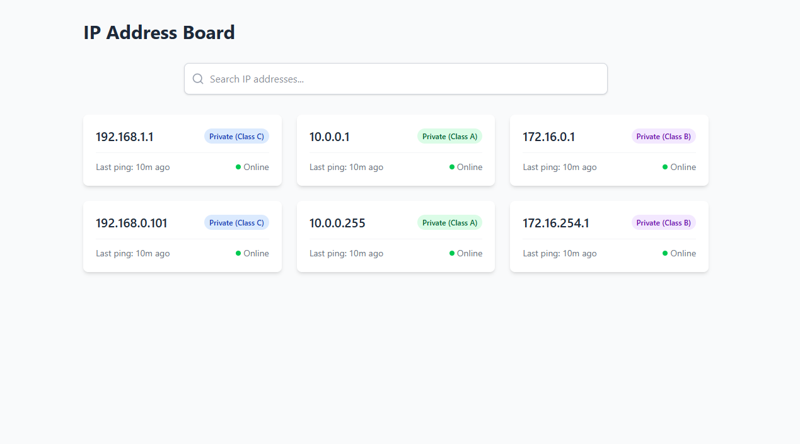

# IP Address Search Board

A modern, responsive React application for managing and searching IP addresses with real-time filtering capabilities and visual classification of IP address types.



## Live Demo

[View Live Demo](https://ip-address-board.vercel.app/)

## Features

- **Real-time Search**: Instantly filter IP addresses as you type
- **Visual IP Classification**: Automatic detection and color-coding of IP address classes
- **Responsive Design**: Fully responsive grid layout that works on all devices
- **Search Highlighting**: Visual highlighting of matching search terms
- **Status Indicators**: Live status monitoring for each IP address
- **Modern UI**: Clean, intuitive interface with smooth transitions

## Technology Stack

- React 18
- TypeScript
- Tailwind CSS
- React Router DOM
- Lucide React Icons
- Vite

## Getting Started

### Prerequisites

- Node.js (v14 or higher)
- npm (v6 or higher)

### Installation

1. Clone the repository:
```bash
git clone <repository-url>
```

2. Install dependencies:
```bash
npm install
```

3. Start the development server:
```bash
npm run dev
```

4. Open your browser and navigate to `http://localhost:5173`

## Project Structure

```
src/
├── components/           # Reusable UI components
│   ├── IPAddressCard/    # IP address card component
│   ├── SearchBar/        # Search input component
│   └── HighLightMatch/   # High light match component
├── pages/                # Page components
├── assets/               
│   └── data/             # Mock data and constants 
└── main.tsx              # Application entry point
```

## Features in Detail

### IP Address Classification

The application automatically classifies IP addresses into three categories:
- **Class A** (10.0.0.0 to 10.255.255.255)
- **Class B** (172.16.0.0 to 172.31.255.255)
- **Class C** (192.168.0.0 to 192.168.255.255)

### Search Functionality

- Real-time filtering of IP addresses
- Highlights matching portions of search results
- Clear search button for quick reset
- Search count indicator

## Contributing

1. Fork the repository
2. Create your feature branch (`git checkout -b feature/AmazingFeature`)
3. Commit your changes (`git commit -m 'Add some AmazingFeature'`)
4. Push to the branch (`git push origin feature/AmazingFeature`)
5. Open a Pull Request

## License

This project is licensed under the MIT License - see the LICENSE file for details.

## Acknowledgments

- Icons provided by [Lucide React](https://lucide.dev)
- UI components styled with [Tailwind CSS](https://tailwindcss.com)